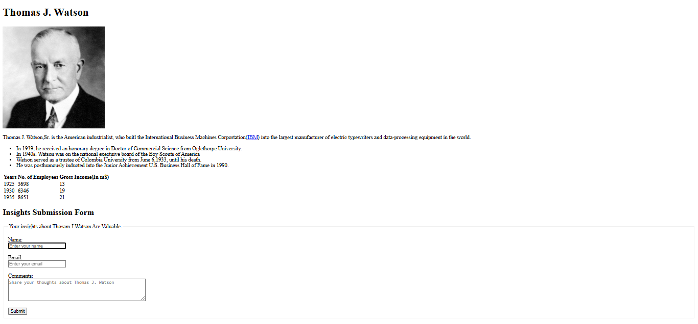

# **Thomas J. Watson Sr. Biography Page 🌟**

A simple **biography page for Thomas J. Watson Sr.** built using **HTML**.  
This project highlights his life, achievements, and allows users to submit their insights through a feedback form.

---

## **🚀 Features**
- Overview of Thomas J. Watson Sr.’s life  
- List of major achievements  
- IBM growth table (employees & income)  
- Feedback form for visitor insights  

---

## **🛠️ Technologies Used**
- **HTML5**

---

## **📂 How to Run**
1. Clone the repository:  
   ```bash
   git clone https://github.com/AbdulRehman393/thomas-watson-biographypage.git
Open the index.html file in any web browser.

Learn about Thomas J. Watson Sr. and leave your insights 🎉

📸 Demo Screenshot



👨‍💻 Author
<br>
<br>
Abdul Rehman
<br>
<br>
<a href="https://github.com/AbdulRehman393" target="_blank">  </a>
<a href="https://www.linkedin.com/in/khawaja-abdul-rehman-24088b266/" target="_blank">  </a>
<a href="mailto:khawajaabdulrehman393@gmail.com" target="_blank">  </a>
